# Atlas record detail page — redesign mockups

Static, non-production design mockups for the record detail page (`/record?uri=…`).
The Atlas topbar and the left navigation rail are kept exactly as they are today; everything
below the title bar is up for redesign.

Every mockup uses real values from real PDS products so the layouts are stress-tested with
true field lengths:

- Mastcam-Z Right, `ZRF_1221_0775339022_769RZS_N0561010ZCAM09271_0630LMJ01.IMG` (Sol 1221, sequence ZCAM09271)
- Navcam Right, `NRF_1279_0780483423_145CWG_N0600000NCAM13279_0A0195J02.IMG` (Sol 1279)
- MGS Mars Orbiter Camera, `M0400821.IMG` (1999, 22 label fields, no browse image) for the sparse case

Mockups 1–4 cover the overview tab, a caption-first mode, template authoring and related-products
browsing. Mockups 5–16 are twelve further takes on the main record page only, each keeping the
same shell and exploring a different information architecture.

The templating idea shared by every mockup: a template is registered per
`mission / instrument / processing level`, renders several variants from one source
(panel description, viewer caption, short card caption, alt text, citation), highlights the fields
it resolved, and silently drops clauses whose fields are absent from the label — so a missing
field never shows up as a blank or `undefined` in prose.

---

## 1. Overview redesign


The default tab, rebuilt around reading rather than scanning a flat list.

- Templated **About this product** paragraph at the top of the panel, with resolved values linked and
  a footer showing the template used, how many optional fields were missing, and a cite action.
- Templated caption under the image with the key facts as chips, plus provenance
  (`Rendered from caption.mars_2020.ncam · 8 tokens resolved, 1 optional clause skipped`).
- **At a glance** tiles promote the fields people actually look for (sol, local time, site/drive,
  instrument, sun elevation, file count); tile selection comes from the template config.
- The 143-field list becomes a filterable, grouped accordion instead of one long scroll, with a
  raw-name toggle for label-accurate names.
- Actions (download, cart, citation, copy link) are pinned to the bottom of the panel.

## 2. Caption-first story layout


An alternate mode for browsing and sharing imagery, where the picture and its caption lead.

- Full-width viewer with a sequence scrubber, so stepping through the 18 frames of ZCAM09271
  never leaves the page.
- Caption band with a headline plus the generated sentence; every filled token is underlined so it
  is obvious what came from the label and what is boilerplate.
- Metadata collapses into an icon drawer (Info / Fields / Map / Label / Files / Save) instead of a
  permanently open 480px panel.
- Template picker on the right shows owner, version, available variants (`short`, `alt-text`,
  `social`), token coverage (`11 of 12 tokens resolved`) and which clause was skipped.
- One-click **Copy caption**, **Copy citation**, and **Download image + caption**.

## 3. Template studio


Where a data curator authors the descriptions and captions the other pages render.

- Left column lists the fields actually present on the open record with their live values, plus the
  available filters (`|round(1)`, `|date('YYYY-MM-DD')`) and the optional-clause helper. Fields
  absent from the label (`filter_bandpass`) are flagged rather than hidden.
- Center is the template source: one document defining `title`, `body`, `links` and `chips`, with
  `{{#if}}` guards for optional clauses.
- Right column previews every variant against the open record simultaneously — panel description,
  viewer caption overlay, accessibility alt text — and states the blast radius before saving
  (`48,912 products matching mission=mars_2020, instrument=MCZ_*`).
- Footer validates the template, reports skipped clauses, and offers a spot-check on random products.

## 4. Related products & sequence browsing


Turns the record page into a jumping-off point instead of a dead end.

- Grid of related products with a short templated caption on every card, so a thumbnail is
  identifiable without decoding the filename.
- Filter chips for the relationships that matter: same sequence, same sol, same site, other
  versions, raw counterparts.
- Right panel keeps the open record in context and lists related groups with counts, generated from
  shared label fields.
- Card captions can be switched between short, full-sentence and filename-only forms — same
  template, different variant.
- Bulk actions: add the whole group to the cart, copy every caption, share the view.

## 5. Read-first document layout

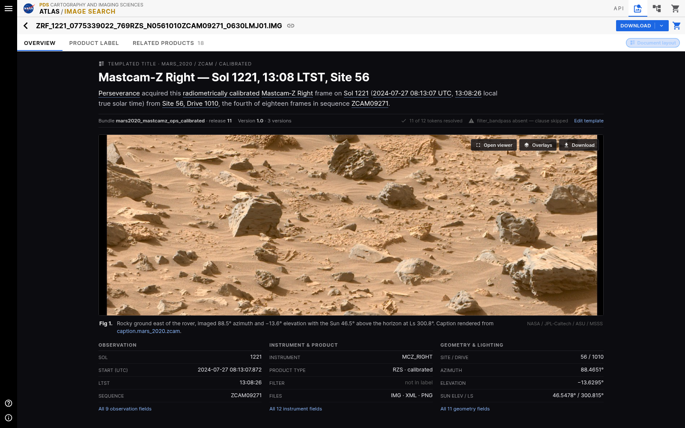

The record treated as a short document: figure with caption, then prose, then the field tables.

- Templated description reads as an article paragraph at a comfortable measure instead of a panel blurb.
- Figure and caption sit together as one block, the way a paper or press page would set them.
- Field tables come after the reading material, in two columns, so the page starts human and ends technical.

## 6. Light metadata surface

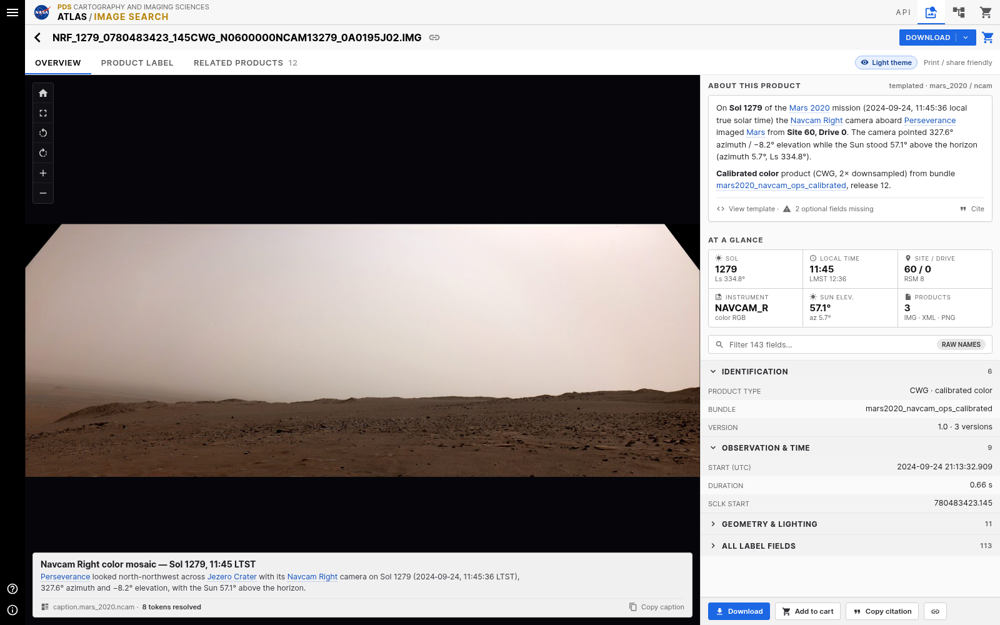

The same overview redesign on the light surface the rest of Atlas already uses; only the viewer stays dark.

- Metadata, caption and field groups adopt the light theme, keeping the record page consistent with search.
- Resolved template values are marked with underlines and weight rather than dark-theme colour tricks.
- Shows how much contrast the templated prose needs to stay readable on white.

## 7. Dense field browser

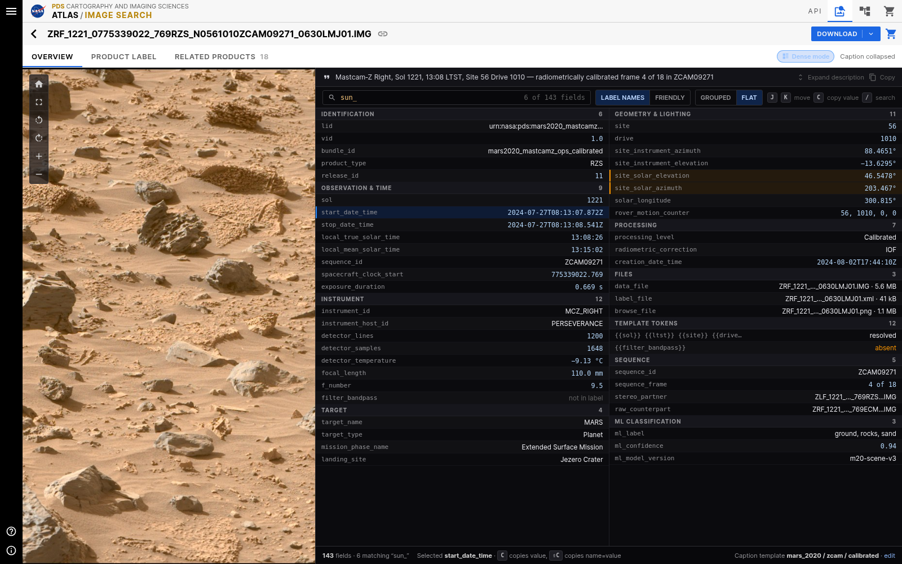

For users who came for the label, not the picture.

- Two-column `key = value` list with live filtering (`sun_` → 6 of 143 fields) and keyboard hints.
- Grouped and flat views of the same 143 fields, with raw label names available.
- The templated caption is reduced to a single line so it never gets in the way of the fields.

## 8. Full-width viewer with a bottom drawer

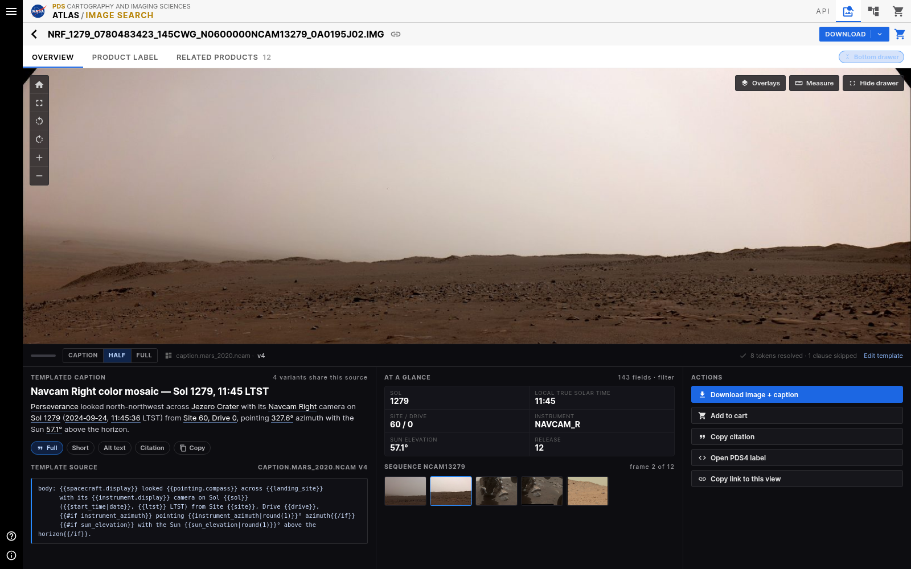

The 480px side panel becomes a drawer that snaps between caption-only, half and full.

- The image gets the whole width, which matters for wide mosaics and panoramas.
- Drawer columns: templated caption plus variants, at-a-glance fields and sequence, actions.
- Template source is visible in the drawer so the caption's provenance is one glance away.

## 9. Context and traverse layout

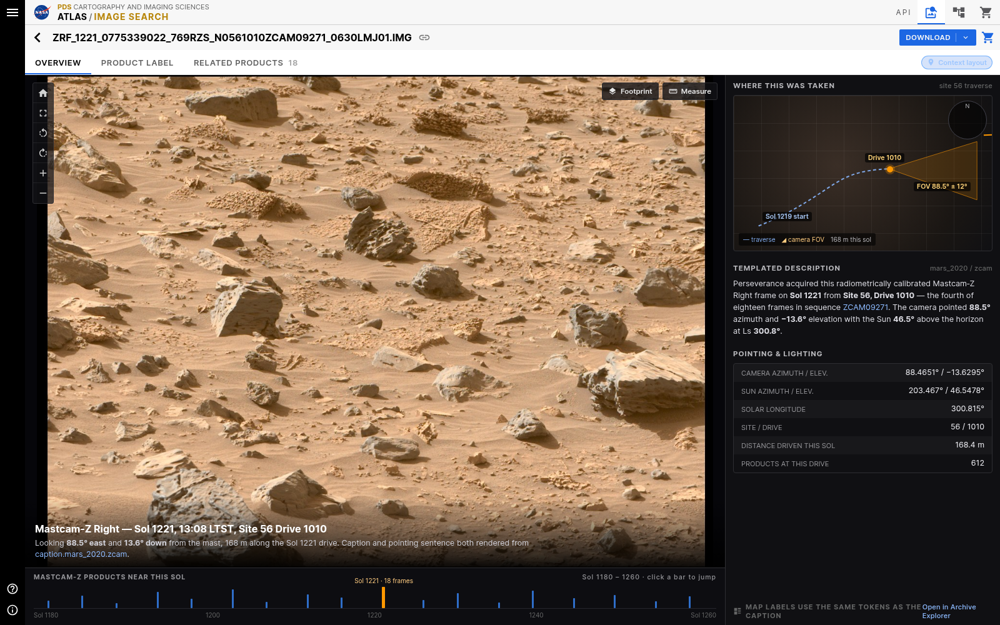

Where the frame was taken, alongside what it shows.

- Site traverse map with the rover path, drive marker and camera field-of-view cone.
- Map labels are driven by the same tokens the caption uses, so text and geometry can't disagree.
- Sol timeline under the image jumps to neighbouring products in the same site.

## 10. Caption variant browser

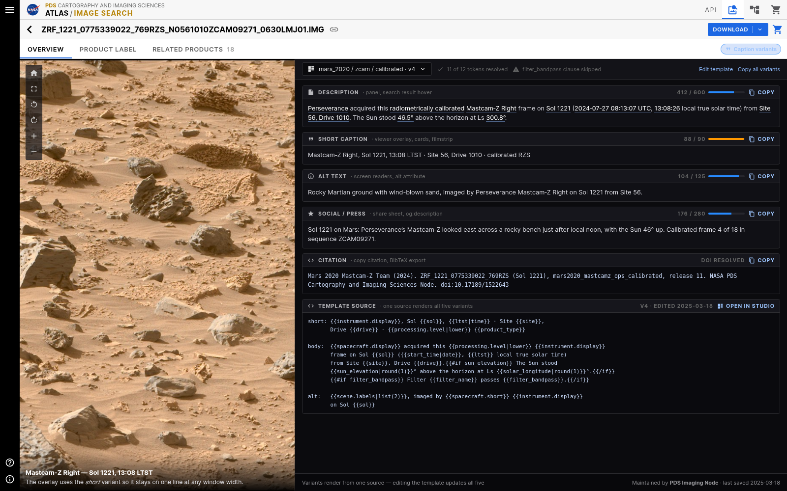

All five renderings of one template, side by side, with their length budgets.

- Description, short caption, alt text, social/press and citation, each with character count and copy action.
- Token coverage and skipped clauses are reported once for the whole set.
- The template source at the bottom makes it obvious that one document produces all five.

## 11. Cinematic hero

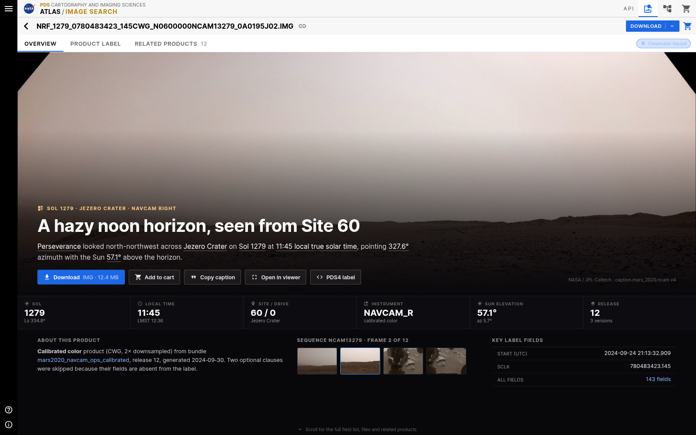

A public-facing record page for people who arrived from a link, not a query.

- Generated headline ("A hazy noon horizon, seen from Site 60") plus templated lede over a full-bleed frame.
- Key facts strip carries the numbers a scientist still needs, without dominating the page.
- Primary actions and the sequence filmstrip stay above the fold; the full field list is a scroll away.

## 12. Compare mode

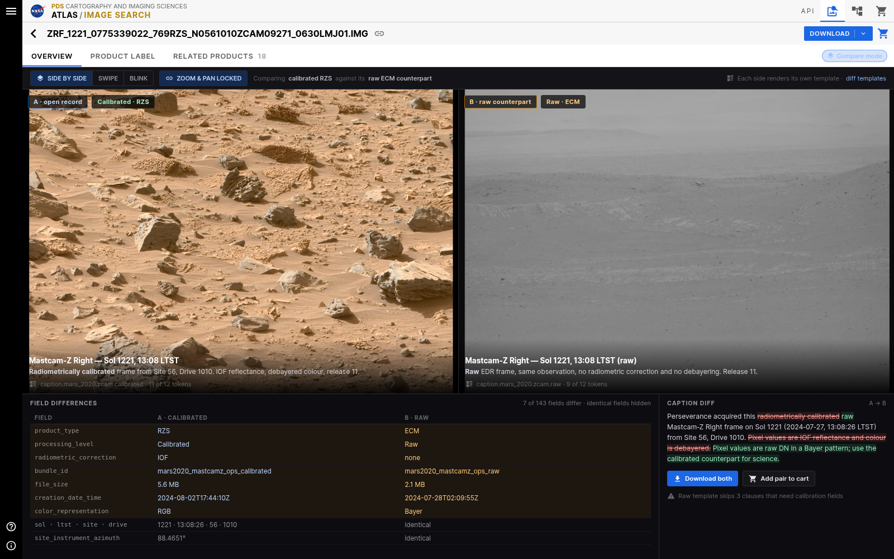

Calibrated against raw, with synced zoom and pan.

- Each side renders its own template, so the difference in processing is stated in prose, not inferred.
- Field differences table hides the 136 identical fields and shows only the 7 that differ.
- Caption diff highlights exactly which clauses change, and the raw template's skipped clauses are called out.

## 13. Overlays and scene tokens

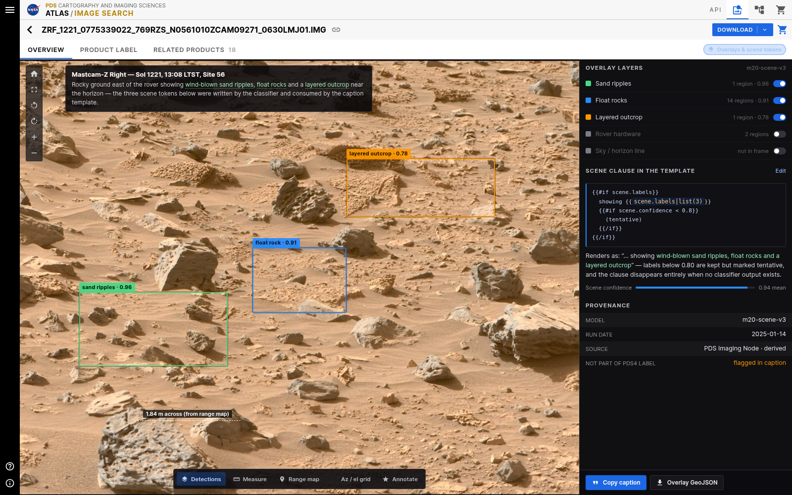

Classifier output as first-class, citable content.

- Detection boxes with confidence values, a measurement line, and toggleable overlay layers.
- The scene clause in the template consumes those labels, marking anything under 0.80 as tentative.
- Provenance panel is explicit that these values are derived and not part of the PDS4 label.

## 14. Workspace layout

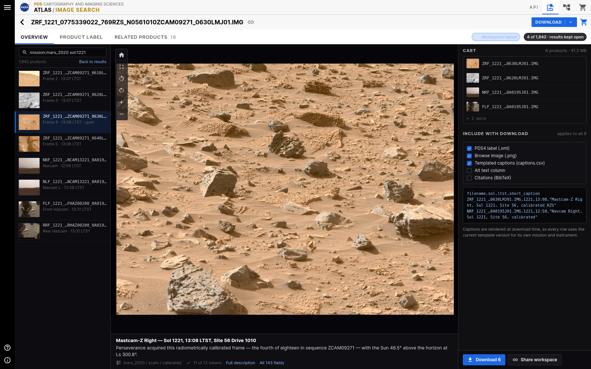

The record page inside a working session, not as a destination.

- Results rail keeps the query alive on the left; the record opens in place.
- Cart and export options live on the right, including templated captions as a CSV column.
- Captions are rendered at download time, so each row uses the current template for its own instrument.

## 15. Narrow widths

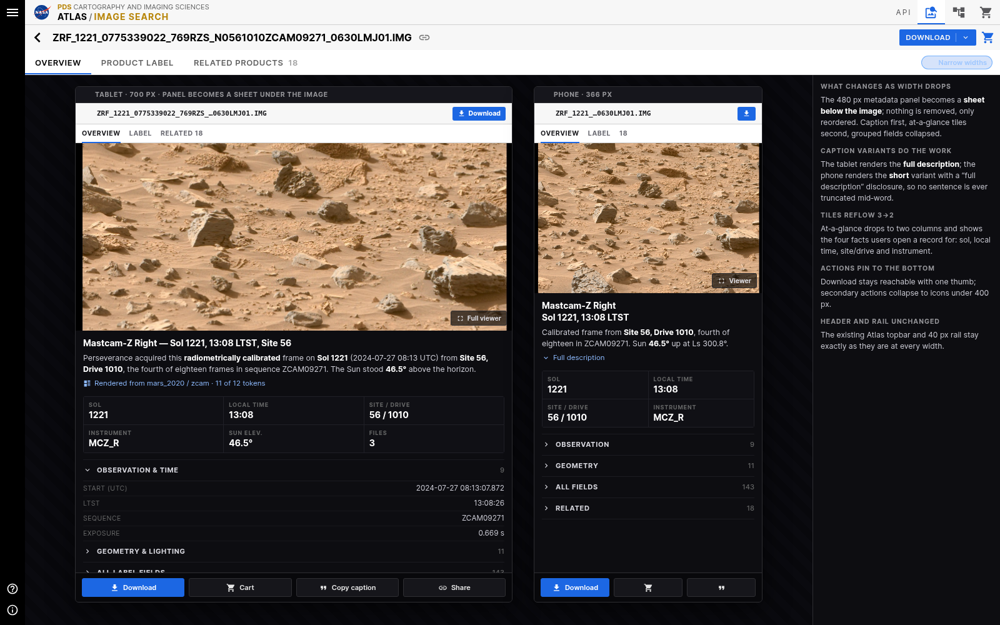

What the redesign does as the window shrinks, at 700px and 366px.

- The metadata panel becomes a sheet under the image; nothing is removed, only reordered.
- Tablet renders the full description, phone renders the short variant with a disclosure — no mid-word truncation.
- At-a-glance tiles reflow 3→2 and actions pin to the bottom; header and rail are untouched.

## 16. Sparse record and fallbacks

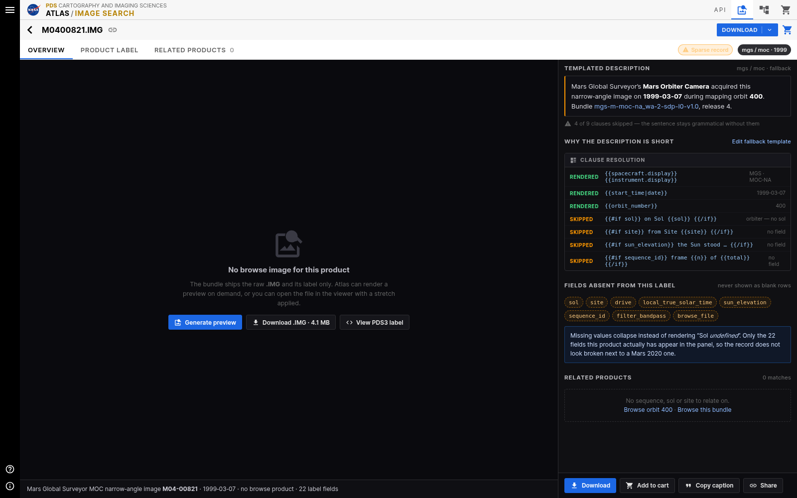

An MGS MOC product with 22 fields and no browse image — the case that breaks templated prose.

- Four of nine clauses are skipped and the sentence stays grammatical.
- Clause resolution table shows exactly which tokens rendered, which were skipped, and why.
- Absent fields are listed as tokens instead of blank rows, and the empty related-products state offers real alternatives.

---

## Regenerating the PNGs

Sources live in `src/` (plain HTML/CSS, no build, no app dependency) and render at 1600×1000:

```bash
cd mockup && ./src/render.sh
```

Requires Google Chrome (or set `CHROME=`) and Python with Pillow. Nothing here is imported by the
application.
