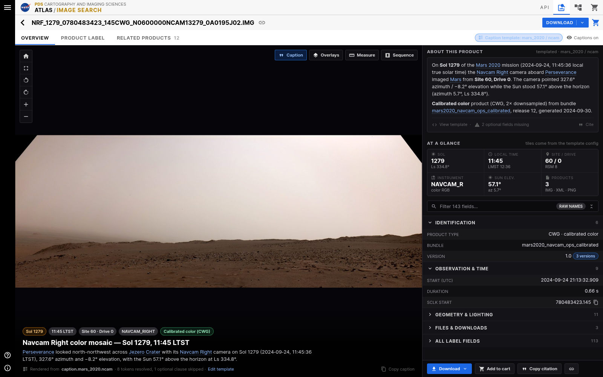
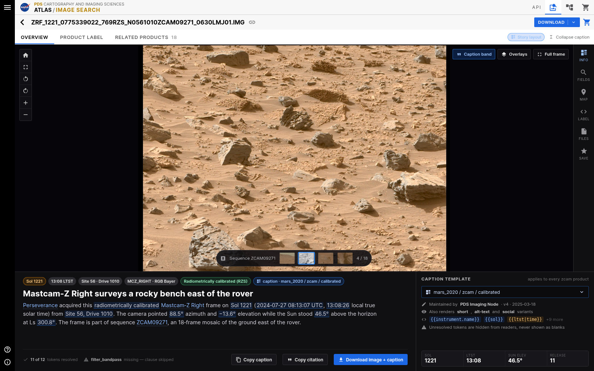
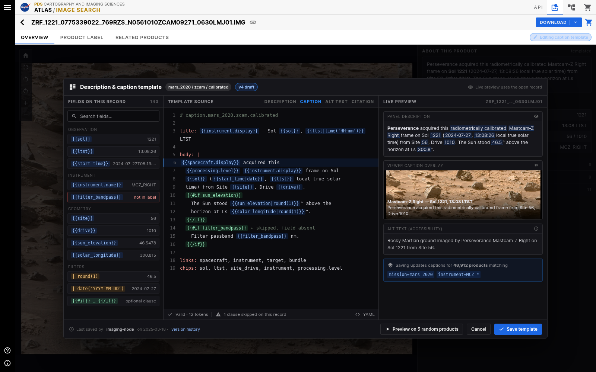
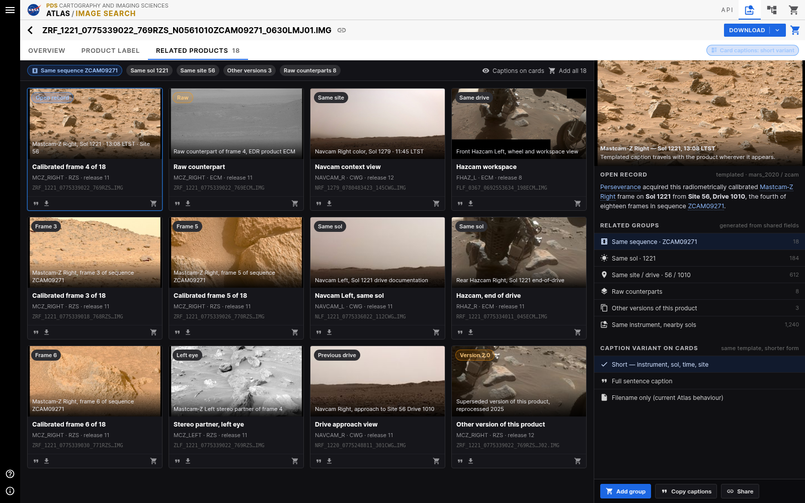

# Atlas record detail page — redesign mockups

Static, non-production design mockups for the record detail page (`/record?uri=…`).
The Atlas topbar and the left navigation rail are kept exactly as they are today; everything
below the title bar is up for redesign.

All four mockups use real values from real PDS products so the layouts are stress-tested with
true field lengths:

- Mastcam-Z Right, `ZRF_1221_0775339022_769RZS_N0561010ZCAM09271_0630LMJ01.IMG` (Sol 1221, sequence ZCAM09271)
- Navcam Right, `NRF_1279_0780483423_145CWG_N0600000NCAM13279_0A0195J02.IMG` (Sol 1279)

The templating idea shared by every mockup: a template is registered per
`mission / instrument / processing level`, renders several variants from one source
(panel description, viewer caption, short card caption, alt text, citation), highlights the fields
it resolved, and silently drops clauses whose fields are absent from the label — so a missing
field never shows up as a blank or `undefined` in prose.

---

## 1. Overview redesign



The default tab, rebuilt around reading rather than scanning a flat list.

- Templated **About this product** paragraph at the top of the panel, with resolved values linked and
  a footer showing the template used, how many optional fields were missing, and a cite action.
- Templated caption under the image with the key facts as chips, plus provenance
  (`Rendered from caption.mars_2020.ncam · 8 tokens resolved, 1 optional clause skipped`).
- **At a glance** tiles promote the fields people actually look for (sol, local time, site/drive,
  instrument, sun elevation, file count); tile selection comes from the template config.
- The 143-field list becomes a filterable, grouped accordion instead of one long scroll, with a
  raw-name toggle for label-accurate names.
- Actions (download, cart, citation, copy link) are pinned to the bottom of the panel.

## 2. Caption-first story layout



An alternate mode for browsing and sharing imagery, where the picture and its caption lead.

- Full-width viewer with a sequence scrubber, so stepping through the 18 frames of ZCAM09271
  never leaves the page.
- Caption band with a headline plus the generated sentence; every filled token is underlined so it
  is obvious what came from the label and what is boilerplate.
- Metadata collapses into an icon drawer (Info / Fields / Map / Label / Files / Save) instead of a
  permanently open 480px panel.
- Template picker on the right shows owner, version, available variants (`short`, `alt-text`,
  `social`), token coverage (`11 of 12 tokens resolved`) and which clause was skipped.
- One-click **Copy caption**, **Copy citation**, and **Download image + caption**.

## 3. Template studio



Where a data curator authors the descriptions and captions the other pages render.

- Left column lists the fields actually present on the open record with their live values, plus the
  available filters (`|round(1)`, `|date('YYYY-MM-DD')`) and the optional-clause helper. Fields
  absent from the label (`filter_bandpass`) are flagged rather than hidden.
- Center is the template source: one document defining `title`, `body`, `links` and `chips`, with
  `{{#if}}` guards for optional clauses.
- Right column previews every variant against the open record simultaneously — panel description,
  viewer caption overlay, accessibility alt text — and states the blast radius before saving
  (`48,912 products matching mission=mars_2020, instrument=MCZ_*`).
- Footer validates the template, reports skipped clauses, and offers a spot-check on random products.

## 4. Related products & sequence browsing



Turns the record page into a jumping-off point instead of a dead end.

- Grid of related products with a short templated caption on every card, so a thumbnail is
  identifiable without decoding the filename.
- Filter chips for the relationships that matter: same sequence, same sol, same site, other
  versions, raw counterparts.
- Right panel keeps the open record in context and lists related groups with counts, generated from
  shared label fields.
- Card captions can be switched between short, full-sentence and filename-only forms — same
  template, different variant.
- Bulk actions: add the whole group to the cart, copy every caption, share the view.

---

## Regenerating the PNGs

Sources live in `src/` (plain HTML/CSS, no build, no app dependency) and render at 1600×1000:

```bash
cd mockup && ./src/render.sh
```

Requires Google Chrome (or set `CHROME=`) and Python with Pillow. Nothing here is imported by the
application.
